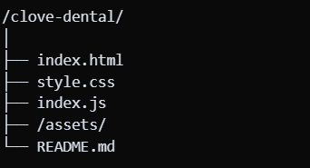

# 🦷 Clove Dental Landing Page

A fully responsive, interactive landing page built using **HTML**, **CSS**, and **Vanilla JavaScript** — designed as part of a Web Dev Internship Assessment.

---

## 🚀 Live Demo

🔗 [View Live on Netlify](https://clovedental-unbundl.netlify.app/)  

---

## 📦 Tech Stack

- HTML5
- CSS3 (Responsive + Mobile-First)
- Vanilla JavaScript (No frameworks)

---

## ✅ Features

- 🔥 Fully responsive on all devices
- 🧠 Accordion-based FAQs and features
- 🧾 Appointment booking form with validation + captcha
- 📞 Click-to-call and scroll interactions
- 🧬 Clean component-based structure
- 🧑‍⚕️ Real transformation gallery + stats
- 📍 Built to match Figma with visual accuracy

---

## 🧱 Project Structure

---

## 📲 Deployment Options

This project can be deployed using:

- ✅ [Netlify](https://clovedental-unbundl.netlify.app/)
- ✅ [GitHub Pages](https://github.com/lohithgpbasu/unboudl-assesment.git)
- ✅ Vercel or any static host

---

## ✍️ Author

**Lohith G P**  
Crafted with precision and passion 🚀

---

## 📄 License

Free to use for educational purposes.
